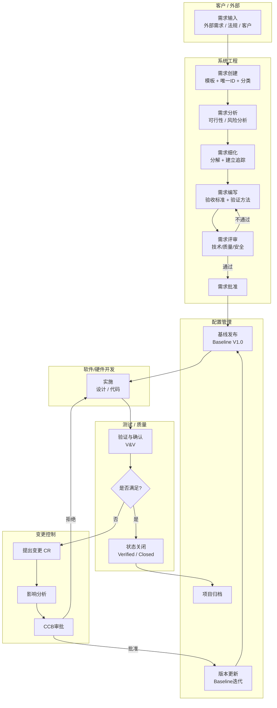

# 模块设计与状态

## 用户管理模块

- [ ] 用户 CRUD
- [ ] 角色 CRUD
- [ ] 权限 CRUD
- [ ] 角色可拥有多个权限 CRUD
- [ ] 用户可拥有多个角色 CRUD

## 项目管理模块

### 流程管理模块

产品从立项至结束，可增删阶段

可建立模板，根据项目类型自动应用模板

阶段：名称、输入、处理、输出

阶段可增删活动，活动之间存在串行或并行关系，但每个阶段必有唯一的首项活动和唯一的结束活动

前一个活动的默认作为下一个活动的输入，跨阶段同样适用

默认存在以下生命周期

#### 需求管理模块

- [ ] 需求类型 CRUD 
  - 如：客户需求、法规要求、行业要求、编码规范
- [ ] 需求输入
  - 标明：来源、类型、说明
- [ ] 分析流程
  - 系统需求 -> 审核 -> 发布冻结 -> 软/硬件需求 -> 审核 -> 发布冻结
  - 环节可增删，每个环节完成需审核，可定义输入输出
- [ ] 输出：系统需求、软件需求、硬件需求

#### 开发管理模块

## 团队管理模块

## 部门管理模块
